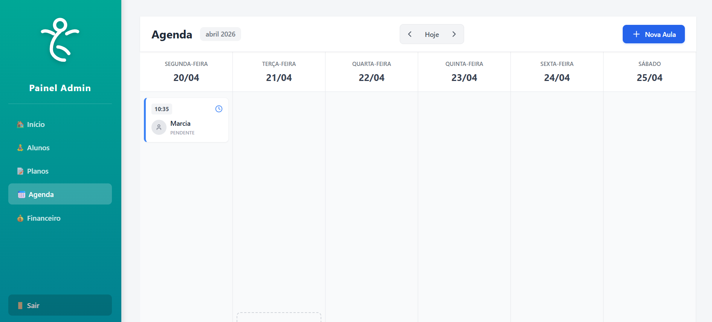
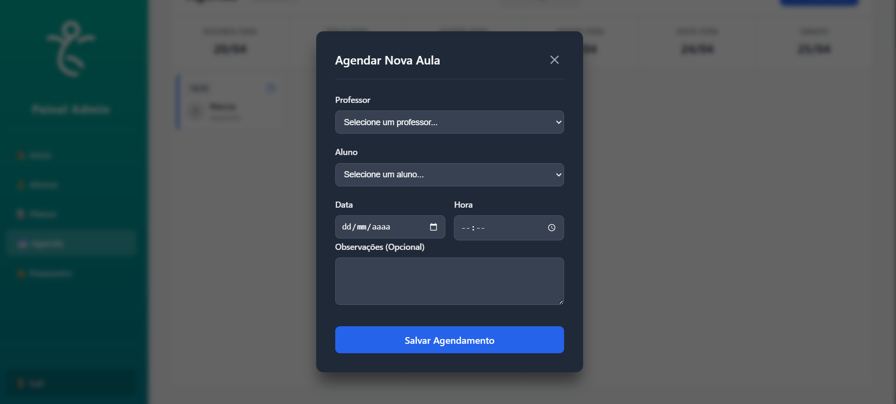

# 🧘 Sistema de Gestão - Pilates Flow

Uma aplicação Full Stack desenvolvida para automatizar a gestão de alunos, organizar horários e calcular comissões em estúdios de saúde e bem-estar, eliminando furos e encavalamentos na agenda.

> 🚧 **Projeto em Desenvolvimento:** Este sistema é um laboratório de estudos práticos de Engenharia de Software.

### 📸 Demonstração
*()*
 

---

## 🧠 Arquitetura e Regra de Negócio

O grande diferencial deste projeto é a separação clara entre a operação diária e o fechamento financeiro, garantindo integridade dos dados:

* **Fluxo Operacional (`historico_aulas`):** Gerencia a agenda, horários e presença. Toda aula é criada com o status padrão de "Pendente".
* **Fluxo Financeiro (`aulas`):** Focada no faturamento. O sistema é programado para que o cálculo de comissionamento do professor e a geração de valor só ocorram quando o status operacional da aula é atualizado para "Concluído".

## 🛠️ Tecnologias Utilizadas

* **Frontend:** React, Axios.
* **Backend:** Node.js, Express.
* **Banco de Dados:** PostgreSQL.

---

## 🚀 Como Rodar o Projeto Localmente

**1. Clone este repositório:**
\`\`\`bash
git clone https://github.com/MateusAlvarengaCaldas
\`\`\`

**2. Iniciando o Backend (API):**
\`\`\`bash
cd backend
npm install
npm run dev
\`\`\`

**3. Iniciando o Frontend (Interface):**
\`\`\`bash
cd frontend
npm install
npm run dev
\`\`\`

---
*Desenvolvido com dedicação por Mateus Alvarenga.*